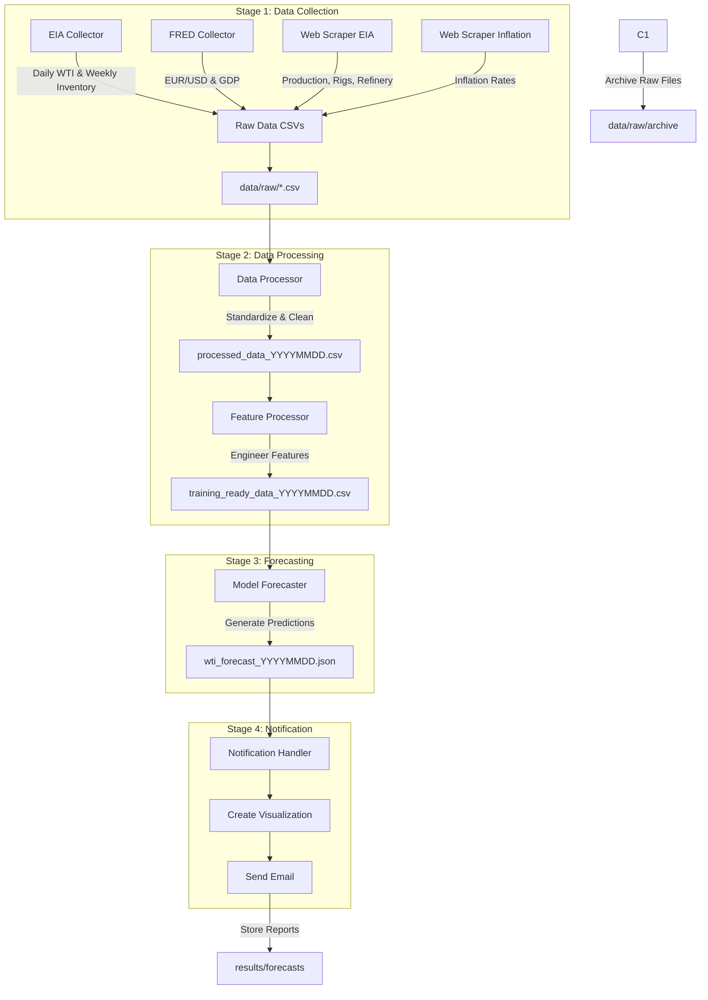
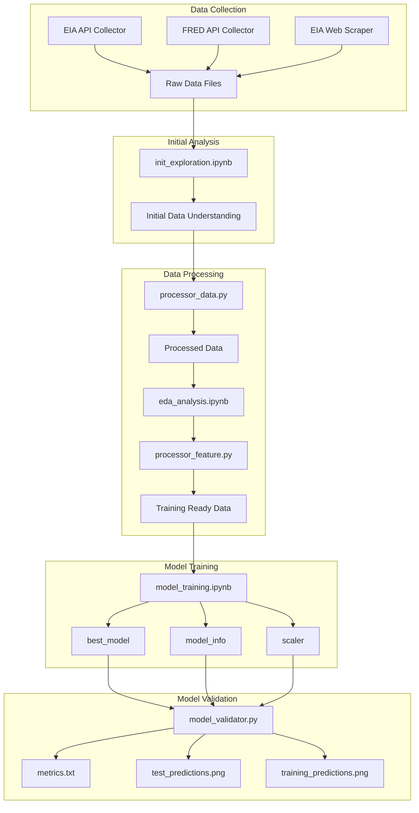

# Model Forecast Pipeline

```mermaid
flowchart TD 
    subgraph "Stage 1: Data Collection"
        A1[EIA Collector] --> |Daily WTI & Weekly Inventory|B1
        A2[FRED Collector] --> |EUR/USD & GDP|B1
        A3[Web Scraper EIA] --> |Production, Rigs, Refinery|B1
        A4[Web Scraper Inflation] --> |Inflation Rates|B1
        B1[Raw Data CSVs] --> B2[data/raw/*.csv]
    end

    subgraph "Stage 2: Data Processing"
        B2 --> C1[Data Processor]
        C1 --> |Standardize & Clean|C2[processed_data_YYYYMMDD.csv]
        C2 --> D1[Feature Processor]
        D1 --> |Engineer Features|D2[training_ready_data_YYYYMMDD.csv]
    end

    subgraph "Stage 3: Forecasting"
        D2 --> E1[Model Forecaster]
        E1 --> |Generate Predictions|E2[wti_forecast_YYYYMMDD.json]
    end

    subgraph "Stage 4: Notification"
        E2 --> F1[Notification Handler]
        F1 --> F2[Create Visualization]
        F2 --> F3[Send Email]
    end

    %% Data flow connections between stages
    С1 --> |Archive Raw Files|G1[data/raw/archive]
    F3 --> |Store Reports|G2[results/forecasts]
```

# Model Training & Validation Pipeline

```mermaid
flowchart TD
    subgraph Data Collection
        A1[EIA API Collector]
        A2[FRED API Collector]
        A3[EIA Web Scraper]
        A1 & A2 & A3 --> B[Raw Data Files]
    end

    subgraph Initial Analysis
        B --> C[init_exploration.ipynb]
        C --> D[Initial Data Understanding]
    end

    subgraph Data Processing
        D --> E[processor_data.py]
        E --> F[Processed Data]
        F --> G[eda_analysis.ipynb]
        G --> H[processor_feature.py]
        H --> I[Training Ready Data]
    end

    subgraph Model Training
        I --> J[model_training.ipynb]
        J --> K1[best_model]
        J --> K2[model_info]
        J --> K3[scaler]
    end

    subgraph Model Validation
        K1 & K2 & K3 --> L[model_validator.py]
        L --> M1[metrics.txt]
        L --> M2[test_predictions.png]
        L --> M3[training_predictions.png]
    end
```